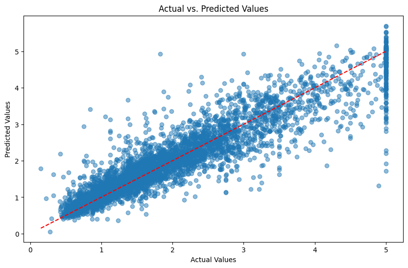
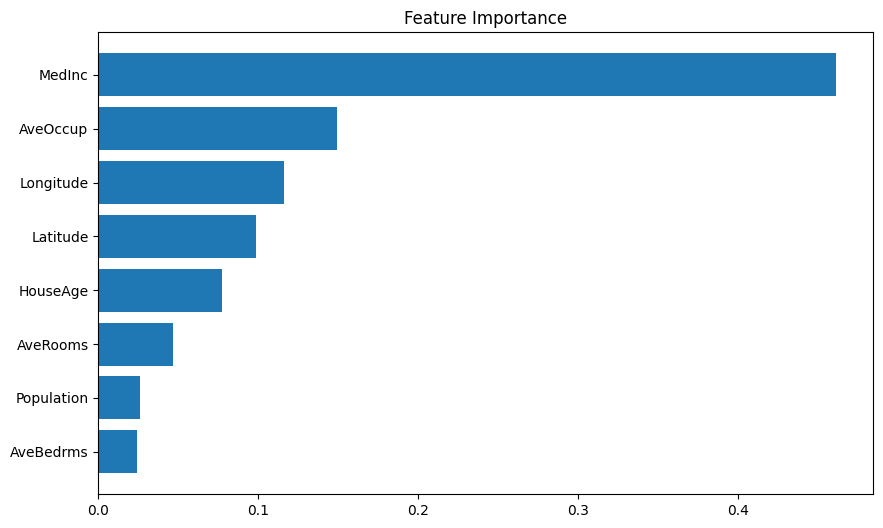

# California Housing Price Prediction

## Overview
This project aims to predict housing prices in California, the dataset is sourced from Scikit-Learn's `fetch_california_housing` module & trained using the XGBoost regression model.

## Dataset
The dataset contains various features related to housing in California, such as median income, house age, number of rooms, and population. 
The target variable is the median house price (in million dollars).


## Dependencies
Ensure the following Python libraries are installed:
```bash
pip install numpy pandas matplotlib seaborn scikit-learn xgboost
```

## Running the Project
To execute the script, run the following command:
```bash
python housing_price_prediction.py
```

## Additional Notes
- If `scikit-learn` version incompatibility arises with XGBoost, downgrade `scikit-learn` using:
  ```bash
  pip uninstall -y scikit-learn
  pip install scikit-learn==1.3.1
  ```
## Images



