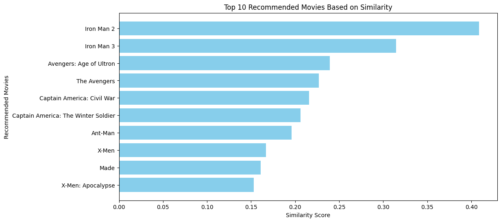
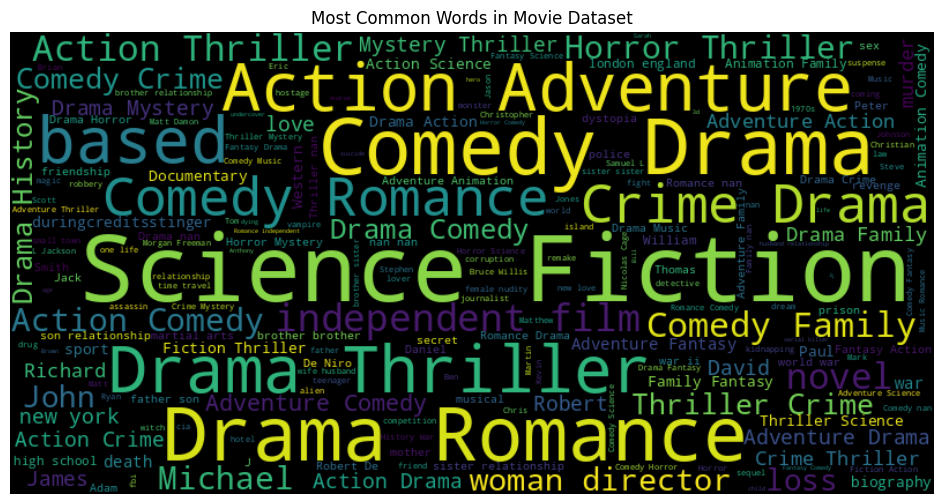

# 🎬 Movie Recommendation System

This project implements a **content-based movie recommendation system** using **TF-IDF Vectorization** and **Cosine Similarity**. It suggests similar movies based on selected features like **genres, keywords, cast, tagline, and director**.

---

## Running the Project
To execute the script, run the following command:
```bash
python movie_recommendation_system_using_cosinesimilarityalgorithm.py
```

---

##  **How It Works**
### **Step 1️.  Load & Preprocess Data**
- Import the dataset.
- Select important features: like `genres, keywords, tagline, cast, director`.
- Fill missing values with an empty string. -> .fillna('')
- Combine selected features into a **single string** for each movie, i.e. combined_features array.

### **Step 2. Convert Data into Vector Format**
- Use `TfidfVectorizer` to transform textual data into a numerical matrix.
- Store transformed feature vectors.

---

## **Visualization**
### **Bar Chart**-> for the user input "Iron Man"


### **Word Cloud of Movie Features**
- Shows the most frequently occurring words in **genres, keywords, and cast**. 
- **Larger words** appear more frequently.  
- **Smaller words** appear less often.



***Note- ***
***The diagram above is in general not for any particular movie search, and if you want for a particular movie, i.e. the list of words thats drive the most support for choosing those movie for best recommendation, code give below***

```python
from wordcloud import WordCloud
import matplotlib.pyplot as plt

# Ensure all columns are converted to string format (to prevent NaN errors)
dataset['genres'] = dataset['genres'].astype(str)
dataset['keywords'] = dataset['keywords'].astype(str)
dataset['cast'] = dataset['cast'].astype(str)
dataset['title'] = dataset['title'].astype(str)

# Filter movies containing "Iron Man" in the title
iron_man_movies = dataset[dataset['title'].str.contains("Iron Man", case=False, na=False)]

# Check if any movies were found
if iron_man_movies.empty:
    print("No movies found with the title containing 'Iron Man'.")
else:
    # Combine selected text features into a single string
    iron_man_text = " ".join(iron_man_movies['genres'] + " " + 
                             iron_man_movies['keywords'] + " " + 
                             iron_man_movies['cast'])

    # Generate the Word Cloud
    wordcloud = WordCloud(width=800, height=400, background_color="black").generate(iron_man_text)

    # Display the Word Cloud
    plt.figure(figsize=(12, 6))
    plt.imshow(wordcloud, interpolation="bilinear")
    plt.axis("off")
    plt.title("Most Common Words in 'Iron Man' Movies")
    plt.show()

```