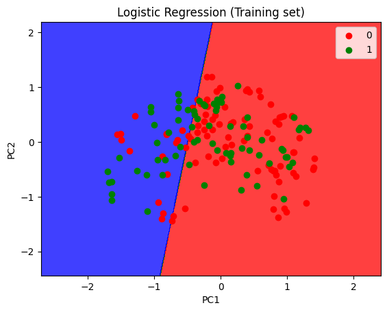

# Sonar Data Classification using PCA & Logistic Regression

## Overview
This project classifies sonar signals using **Logistic Regression**, after applying **Principal Component Analysis (PCA)** for dimensionality reduction. The dataset consists of sonar readings, which are transformed and used to predict target classes.

## Dataset
- **Source**: `sonar_data.csv`
- **Features**: Originally ~60 features representing sonar signal properties.
- **Target**: Binary classification labels (encoded numerically).

## Dependencies
Ensure the following Python libraries are installed before running the code:
```bash
pip install numpy pandas matplotlib scikit-learn
```

## Running the Project
To execute the script, run the following command:
```bash
python sonar_classification.py
```
## Visulization



## Key Features
- Implements **PCA** to reduce feature dimensions.
- Uses **Logistic Regression** for classification.
- **Confusion Matrix & Accuracy Score** for model evaluation.

## Limitations
- The dataset originally has ~60 features; reducing to 2 PCs may lead to information loss.
- For predicting the individual prediction (i.e. the input data containing 60 features) make use of PCA first.
 
