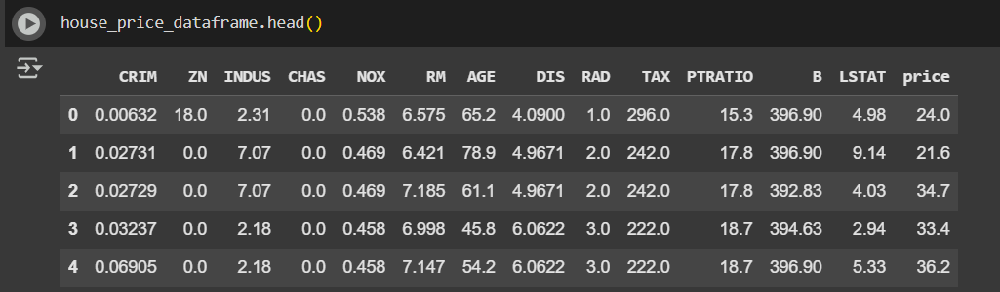
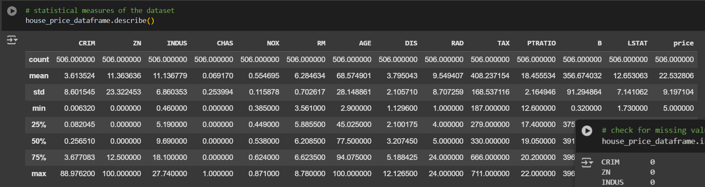
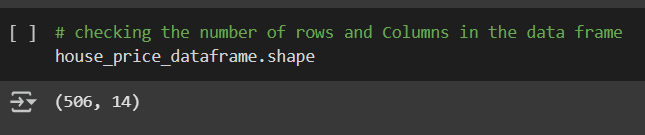
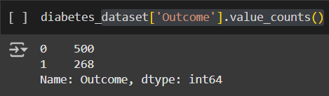
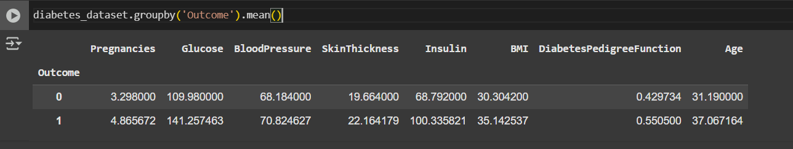
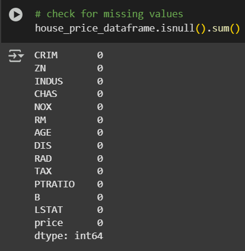

# Welcome to My Machine Learning Journey!

Hey there! I'm **Krishna Gupta**. I've spent the last six months learning the art of Machine Learning, and my journey is still ongoing.  
In this repository, I will share my *recipes* for different Machine Learning algorithms, starting with the basics and progressing to advanced topics. You’ll also find crisp, short notes to help you better understand the code. ╰(*°▽°*)╯

## Topics Covered:

- **Level 1**: Data Preprocessing
- **Level 2**: Regression Models
- **Level 3**: Classification Models
- **Level 4**: Clustering Models
- **Level 5**: Association Rule Learning
- **Level 6**: Reinforcement Learning

## Popular Functions Explained:

- **Fit**: This tells the algorithm to learn how different features contribute to an output. It's like teaching a baby how to build a Lego tower using various blocks.
  
- **Transform**: Here, the algorithm actually creates new outputs when given a set of features, similar to the final step of building the Lego tower.

- **Overfitting**: This happens when an algorithm spends too much time learning from the training dataset. As a result, it gets confused when presented with new data.  
    *Example*: It's like drawing a cat too many times from the same reference image. When given a new image, you can't draw it, or your drawing looks nothing like the original.

- **Underfitting**: The opposite of overfitting, this occurs when the algorithm hasn't learned enough, possibly due to insufficient data or inadequate training.  
    *Example*: It's like not learning enough to draw a cat, because you didn't practice enough or the wrong features were used.

---

## Level 1 - Data Preprocessing

### X → Independent Variable (Features)
These are the data points used to make predictions.
- Example 1: In predicting house prices, X might include features like the house's dimensions, number of bedrooms, or distance from the city.
- Example 2: In a classification model like animal image recognition, X could represent the weight, height, and color of the animal.

### Y → Dependent Variable (Target)
This is the output that the model predicts.
- Example 1: In predicting house prices, Y would be the actual price of the house.
- Example 2: In a classification model, Y could be the category (e.g., DOG, CAT, BIRD, etc.).

The overall goal of an ML algorithm is to establish a relationship between **X** (independent features) and **Y** (dependent output).  
This relationship can be represented as:
\[ Y = F(X) + e \]
where \( e \) is random noise or error.

### Preprocessing Tools:

- **Simple Imputer**: Fills missing values in your dataset by calculating the average value of the entire column. This helps make missing values more realistic and natural.

- **Feature Scaling**: Scales data to fit within smaller ranges:
  1. **Normalization** (range [0, 1]) – Typically used in KNN, neural networks.
  2. **Standardization** (range [-3, +3]) – Commonly used in linear regression, support vector machines (SVM).

- **One-Hot Encoding**: Converts categorical variables into numerical form, especially when there’s no inherent relationship between the categories (e.g., CAT, DOG).

- **Label Encoding**: Converts categorical values into numeric form but is used when there is a relationship between categories, such as customer satisfaction levels (low, medium, high), or binary choices (YES/NO).  
  Example: Low < Medium < High, or YES (1) / NO (0).

---

### 📊 Some Statistical Functions of Pandas Library

1. **`dataset.head()`** → Displays the first five rows of the dataset.
   
   

2. **`dataset.describe()`** → Provides statistical information such as count, mean, standard deviation, min, max, and quartiles (1st, 2nd, 3rd, 4th).
   
   

3. **`dataset.shape()`** → Shows the dataset's dimensions (rows × columns).
   
   

4. **`dataset['Outcome'].value_counts()`** → Displays the count of each unique value in the target (dependent) variable.
   
   

5. **`dataset.groupby('Outcome').mean()`** → Groups data based on the `Outcome` column and calculates the mean for each group.
   
   

6. **`dataset.isnull().sum()`** → Checks for missing values in each column and provides the total count per column.
   
   

### 📈 Evaluation Techniques for Regression and Classification

#### 🟢 Classification Metrics
For classification problems where `y_test` and `y_pred` are categorical (e.g., classes like 0, 1, 2), common evaluation metrics include:
- **Confusion Matrix** → Visualizes correct vs. incorrect predictions.
- **Accuracy Score** → Measures the proportion of correctly classified instances.

#### 🔵 Regression Metrics
For regression problems where `y_test` and `y_pred` are continuous values, the following metrics are commonly used:
- **Mean Absolute Error (MAE)** → Measures the average absolute differences between actual and predicted values.
- **Mean Squared Error (MSE)** → Computes the average squared differences between actual and predicted values.
- **Root Mean Squared Error (RMSE)** → Square root of MSE, providing a more interpretable error measure.
- **R² Score (Coefficient of Determination)** → Indicates how well the model explains the variance in the target variable.